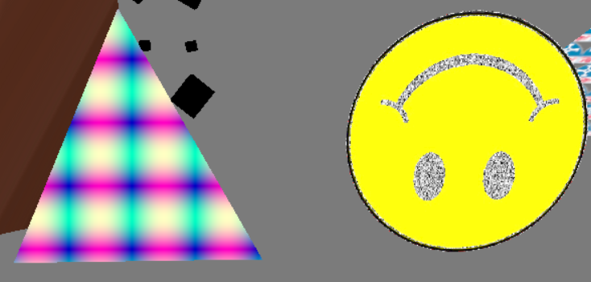
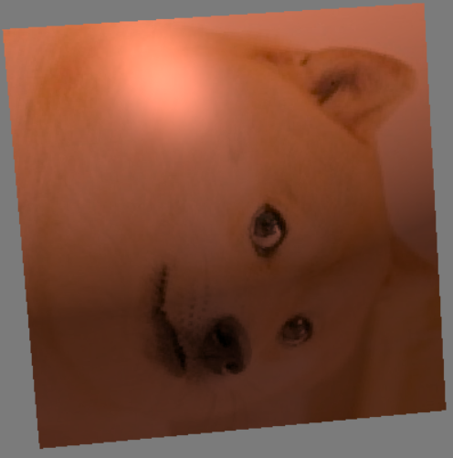
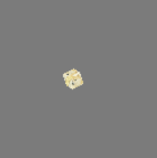

<!--  -->

# Graphics

## What is this?

- This is a set of simple graphics demos using opengl, and a graphics framework provided by the university
- The work I have done is to extend the renderer by making textures and shaders more easily useable, and by adding many functions to toggle and switch opengl features
- I have also built some shader demos, a starfield generator and other graphics demos, which can also be explored with some keyboard controls

## How to run

- There are pre built executables which may work on your machine at "Graphics/x64.zip" and must be extracted so that the path to the executables is "Graphics/x64/Release/"
  - These do not work properly in isolation and require the full project structure in the repo
- Alternatively the projects can be built and run in visual studio
  1. Open the solution in visual studio
  2. Set the project you want to run as the "Startup Project"
     - The tutorial project may fail to build with a linking error. I have found that compiling "RasterisationMesh.h" by itself, before building, builds successfully
  3. Build and run

## Controls

- Camera controls (available in all projects)
  - Move mouse to move camera
  - R - toggle camera rotation
  - wasd - to move camera
  - space, shift - move camera up and down
  - numpad PLUS, numpad MINUS - increase/decrease field of view
  - (top row) PLUS, MINUS - increase/decrease camera movement speed
  - (top row) 0 - reset camera state
  - (top row) 2 - toggle between FPS and almost free camera
    - almost free camera moves forwards/backwards and upwards/downwards, relative to the camera, but still locks when looking up or down, because it does not use quaternions
- Renderer controls (available in all projects)
  - (top row) 1 - reset renderer controls state to normal behavior
  - F - toggles whether to only draw the frames of the triangles
  - f1 - toggles depth buffer by enabling/disabling depth testing
  - f2 - change depth testing mode to pass depth test, when the new depth is less than or equal to the stored depth (this is the normal behavior)
  - f3 - change depth testing mode to always pass depth test (objects are drawn in the order they are put on the gpu)
  - f4 - change depth testing mode to pass the depth test when the new depth is greater than to the stored depth (always grey because of the background)
  - f5 - toggles alpha blending
  - f6 - change blending mode (normal behaviour)
  - f7 - change blending mode (additive)
  - f8 - change blending mode (greyish)
  - f11 - write depth buffer to image "Depth.png" (this will require editing to see anything clearly)
- Shader controls (only available in the Coursework2 Project)
  - numpad 0 - reset shaders to default
  - numpad 1 - use shrinking cube shader (vertex shader)
  - numpad 2 - use texture to static shader (fragment shader)
  - numpad 3 - use alpha fade shader (fragment shader)
  - numpad 4 - use disintegration shader (tesselation + geometry shader)
  - numpad 5 - use spiky breathing cube shader (tesselation + geometry shader)
  - numpad 6 - use phong lighting shader (fragment shader)
  - numpad 7 - use quadruple cube shader (geometry shader)

## Some details and screenshots

<figure>
  
  <figcaption><em>
  This is the CourseWork1 Project. It is a procedurally generated starfield, where stars and some "asteroids" (simple shapes), are generated as the camera is moved. The glider always stays in front of the camera, and the camera's default behavior is that it moves forwards in the direction the camera is facing, and upwards is orthogonal to that
  </em></figcaption>
</figure>

<figure>
  
  <figcaption><em>
  This shows some simple software rasterisation, with the top triangle being rendered using barycentric coordinates to fill in the triangle and interpolate the colours. It was designed to only render 2d shapes without perspective projection, which is why it doesn't look "full"
  </em></figcaption>
</figure>

<figure>
  
  <figcaption><em>
  This is an example of alpha blending for transparency
  </em></figcaption>
</figure>

<figure>
  
  <figcaption><em>
  This is what the output of the depth buffer looks like, once the raw output has been edited to improve contrast and saturation
  </em></figcaption>
</figure>

<figure>
  
  <figcaption><em>
  This is an example of some fragment shaders. The triangle is coloured with sine and cosine of the screen position. The smiley face, samples from two different textures depending on the colour of the texel
  </em></figcaption>
</figure>

<figure>
  
  <figcaption><em>
  This is an example of a geometry shader. It expands points into cubes, which are then textured by the fragment shader
  </em></figcaption>
</figure>

<figure>
  
  <figcaption><em>
  This is an example of mip mapping and tiling textures
  </em></figcaption>
</figure>

<figure>
  
  <figcaption><em>
  This is a shader that produces a height map from a perlin noise texture. This effect is achieved with tesselation shaders
  </em></figcaption>
</figure>

<figure>
  
  <figcaption><em>
  This is a simple shader that transitions from one texture to another over some time, and is done with only a fragment shader
  </em></figcaption>
</figure>

<figure>
  
  <figcaption><em>
  This is the disintegration shader, which uses a combination of vertex, tesselation and geometry shaders to achieve this effects
  </em></figcaption>
</figure>

<figure>
  
  <figcaption><em>
  This is the fading shader, which uses a fragment shader to alter the alpha value of the cube, gradually making it fully transparent
  </em></figcaption>
</figure>

<figure>
  
  <figcaption><em>
  This is a shader that implements phong shading, to give a simple light effect
  </em></figcaption>
</figure>

<figure>
  
  <figcaption><em>
  This is a shader to expand a cube into four smaller cubes in each corner of the original cube, which uses a geometry shader to achieve this effect
  </em></figcaption>
</figure>

<figure>
  
  <figcaption><em>
  This is a shader to shrink a cube until it disappears. This is done with the use of a vertex shader
  </em></figcaption>
</figure>

<figure>
  
  <figcaption><em>
  This is a shader that gives the effect of a spiky breathing cube. This effect is achieved with tesselation and geometry shaders
  </em></figcaption>
</figure>
